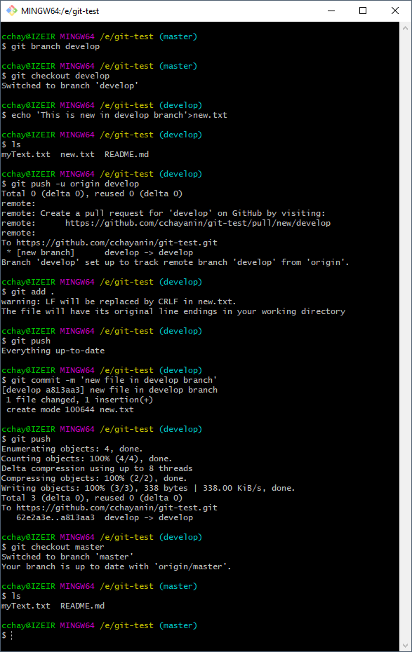
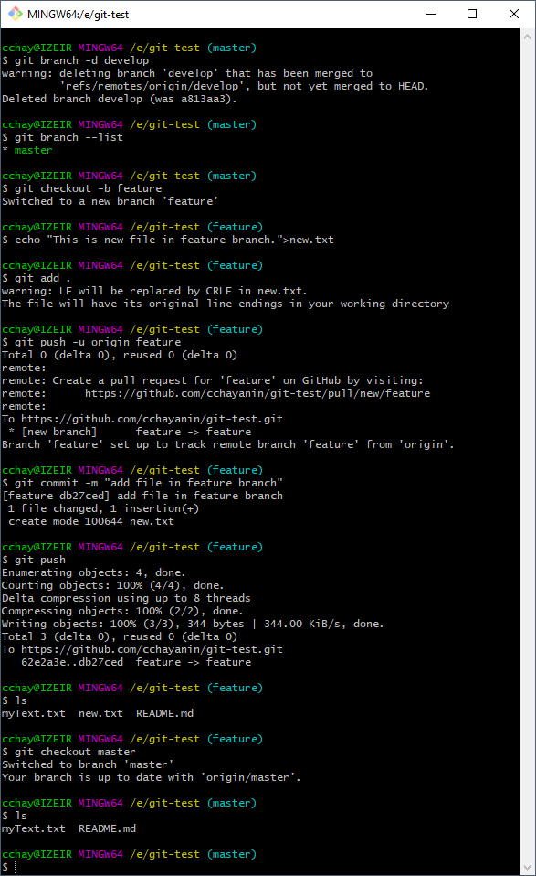

## CodeCamp # 5

## ชญานิน ชลหาญ

- สร้าง branch ใหม่ด้วย git branch

- checkout ไป branch ใหม่

- สร้าง ไฟล์ .txt

- แก้ไข ไฟล์ .txt

- upload file ขึ้น branch ใหม่

- สลับกลับมา master

- ดูการเปลี่ยนแปลงที่เกิดขึ้น  
  

- ลบ branch ด้วย git branch -d branch_name

- ลอง ใช้คำสั่ง git checkout -b branch_name

- สร้างไฟล์ .txt upload

- สลับมา master

- ดูการเปลี่ยนแปลง  
  
