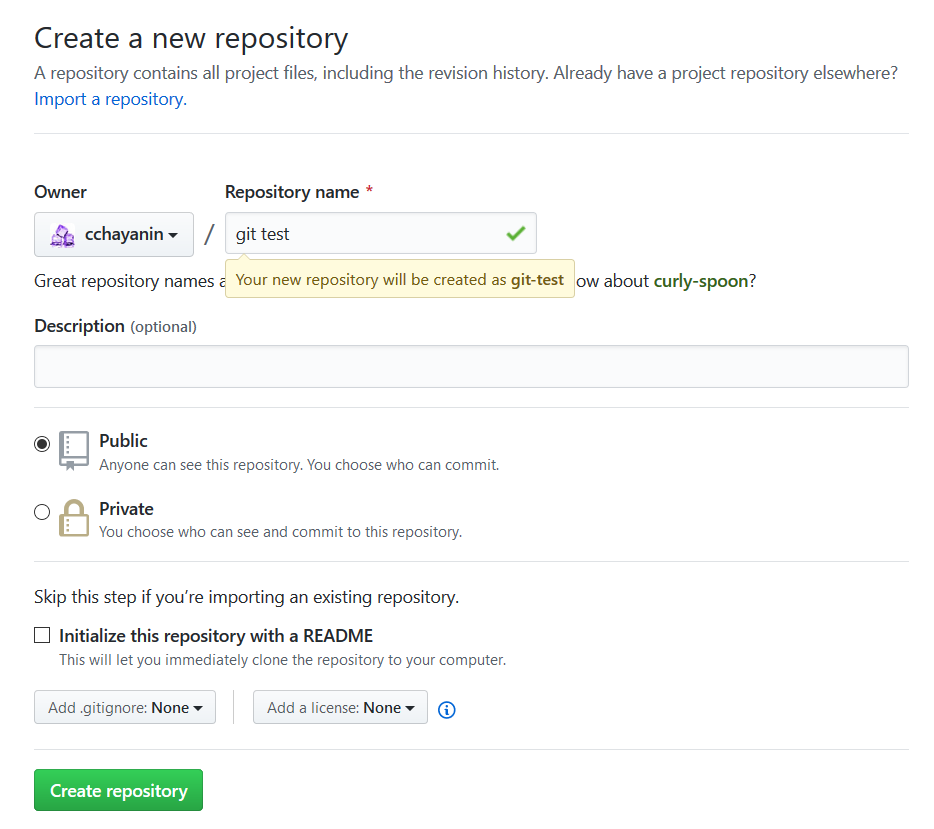
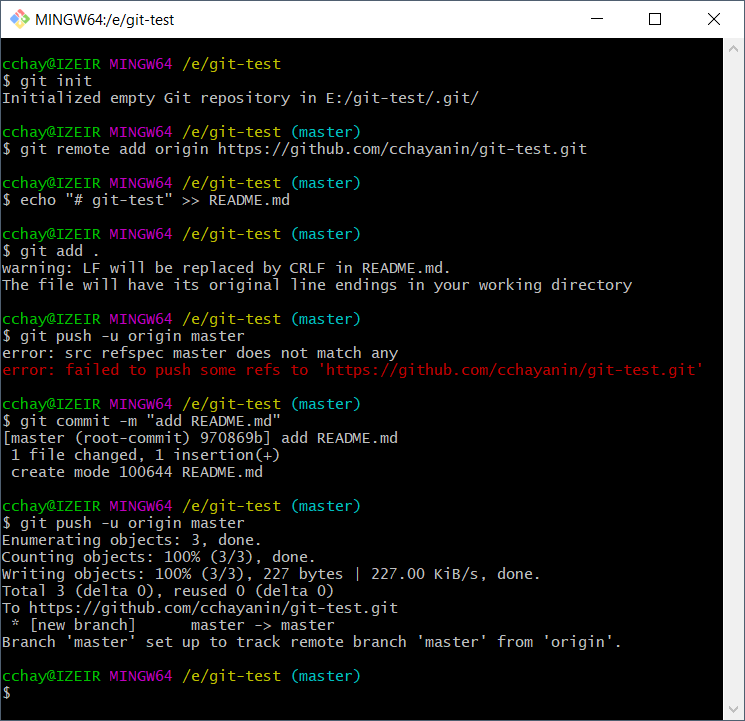

## CodeCamp # 5

## ชญานิน ชลหาญ

[git test](https://github.com/cchayanin/git-test)

- ให้สร้าง git reprository ใหม่

- ขึ้นมาว่า git test  
  

- ทำการสร้าง folder ที่จะเก็บไฟล์ภายในเครื่อง

- คลิกขวาที่ folder ที่สร้างขึ้นมาใหม่และรัน git bash

- ทำการเชื่อม github กับ computer เรา

- สร้างไฟล์ Readme.md  
  
