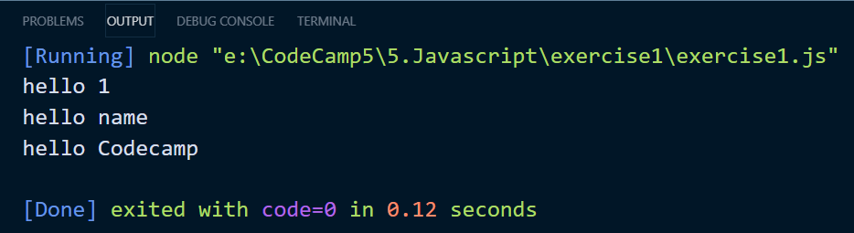

## CodeCamp # 5

## ชญานิน ชลหาญ

### ผลลัพธ์ทั้ง console.log ทั้งสามคืออะไร

```javascript
let name = "Codecamp";

console.log(`hello ${1}`);
console.log(`hello ${"name"}`);
console.log(`hello ${name}`);
```


