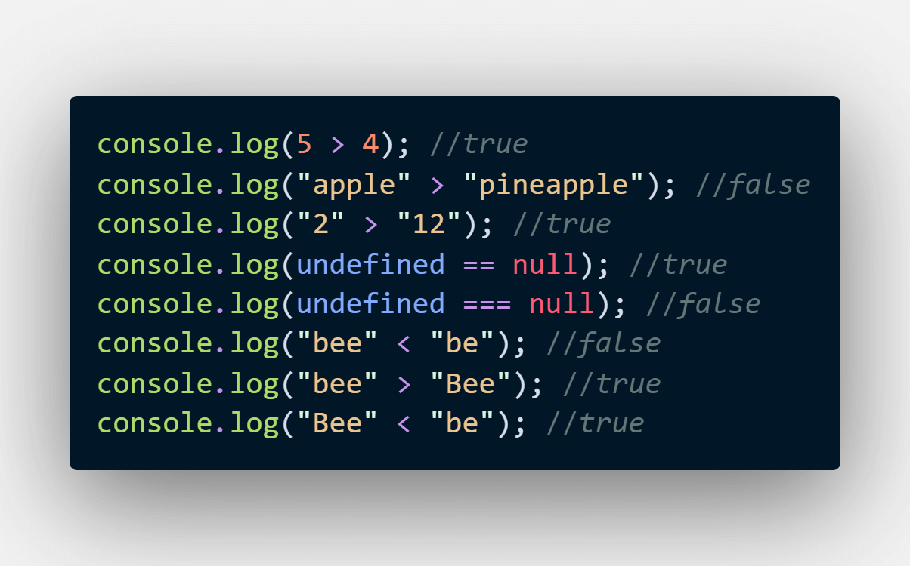

## CodeCamp # 5

## ชญานิน ชลหาญ

### จงหาค่าของการเปรียบเทียบต่อไปนี้

```
    5 > 4
    “apple” > “pineapple”
    “2” > “12”
    undefined == null
    undefined === null
    “bee” < “be”
    “bee” > “Bee”
    “Bee” < “be”
```


