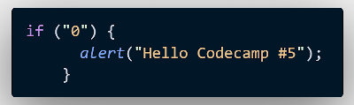

## CodeCamp # 5

## ชญานิน ชลหาญ

### 1. Browser จะโชว์ข้อความ “Hello Codecamp #5” ไหม



`แสดง เพราะ Boolean("0") ได้ค่าความจริงเป็น true`

### 2. ใช้ if else ในการเขียนถามชื่อของคุณ

- ถ้าตอบถูกให้แสดงคำว่า “เก่งมาก”
- ถ้าตอบผิดให้แสดงคำว่า “คุณไม่รู้จักชื่อฉัน”  
  [exercise5.2](exercise5.2.html)

```
    let name = prompt("กรุณาป้อนชื่อของคุณ : ");

    if (name.toUpperCase() === "ICE") {
      alert("เก่งมาก");
    } else {
      alert("คุณไม่รู้จักชื่อฉัน");
    }
```

### 3. ใช้ prompt ในการรับคะแนนมาคำนวณเกรด

- ถ้าคะแนน **_มากกว่าเท่ากับ 80_** ได้ A
- ถ้าคะแนน **_อยู่ระหว่าง 70 - 79_** ได้ B
- ถ้าคะแนน **_อยู่ระหว่าง 60 - 69_** ได้ C
- ถ้าคะแนน **_อยู่ระหว่าง 50 - 59_** ได้ D
- ถ้าคะแนน **_น้อยกว่า 50_** ได้ F  
  [exercise5.3.html](exercise5.3.html)  
  [exercise5.3.js](exercise5.3.js)

```
    let score = prompt("กรุณาระบุคะแนน");

    if (score >= 80) {
    alert("Grade A");
    } else if (score >= 70) {
    alert("Grade B");
    } else if (score >= 60) {
    alert("Grade C");
    } else if (score >= 50) {
    alert("Grade D");
    } else {
    alert("Grade F");
    }
```

### 4. เปลี่ยน if-else ข้างล่างในอยู่ในรูปของ Ternary Operators

```
  let age = prompt("How old are you?");
  let price;
  if (age < 18) {
    price = 2000;
  } else {
    price = 3500;
  }
```

---

```
  let age = prompt("How old are you?");
  let price;
  age < 18 ? (price = 2000) : (price = 3500);
```
