## CodeCamp # 5

## ชญานิน ชลหาญ

### จงเขียน method draw(int n) ให้ print ออกมาในกรณีที่ n มีค่าต่างๆ ได้ผลลัพธ์ดังนี้

1. 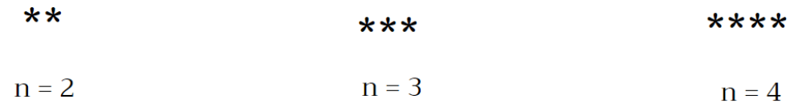

```
    function draw(n) {
    let star = "";
    for (let i = 0; i < n; i++) {
        star += "*";
    }
    console.log(star);
    }
```

2. 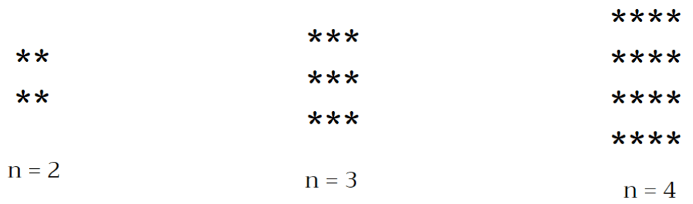

```
function draw(n) {
  let star = "";
  for (let i = 0; i < n; i++) {
    for (let j = 0; j < n; j++) {
      star += "*";
    }
    star += "\n";
  }
  console.log(star);
}
```

3. 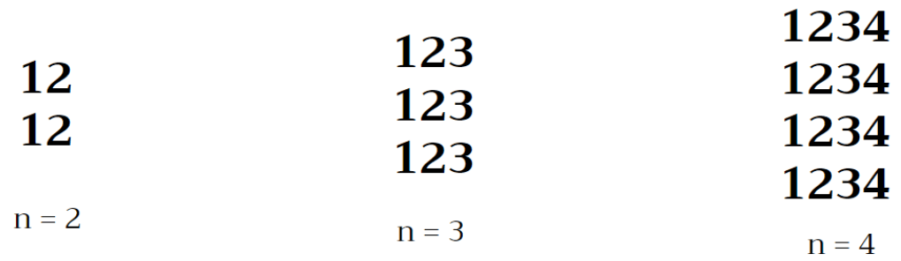

```
    function draw(n) {
    let star = "";
    for (let i = 1; i <= n; i++) {
        for (let j = 1; j <= n; j++) {
        star += String(j);
        }
        star += "\n";
    }
    console.log(star);
    }
```

4. 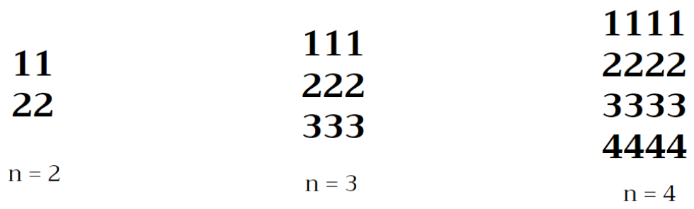

```
function draw(n) {
  let star = "";
  for (let i = 1; i <= n; i++) {
    for (let j = 1; j <= n; j++) {
      star += String(i);
    }
    star += "\n";
  }
  console.log(star);
}
```

5. 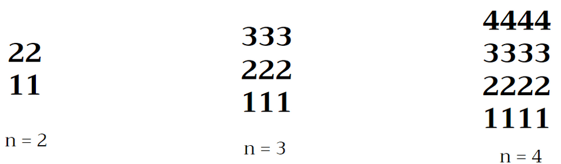

```
    function draw(n) {
    let star = "";
    for (let i = n; i > 0; i--) {
        for (let j = n; j > 0; j--) {
        star += String(i);
        }
        star += "\n";
    }
    console.log(star);
    }
```

6. 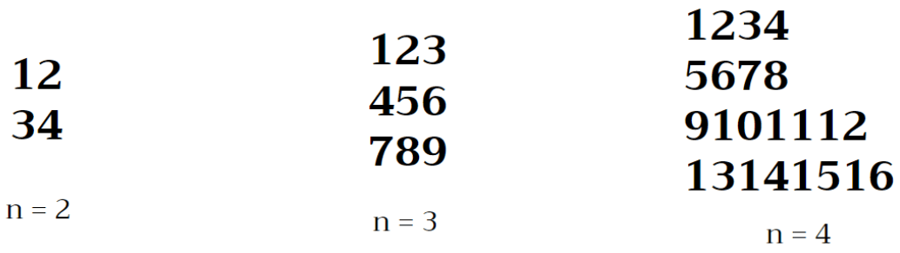

```
    function draw(n) {
    let star = "";
    let count = 1;
    for (let i = 1; i <= n; i++) {
        for (let j = 1; j <= n; j++) {
        star += String(count);
        count++;
        }
        star += "\n";
    }
    console.log(star);
    }
```

7. 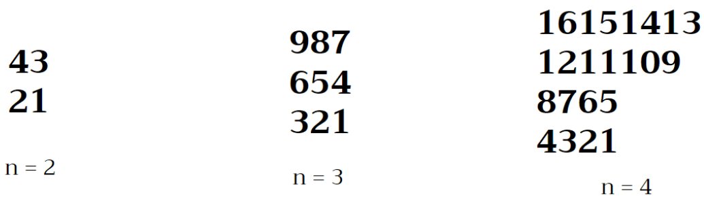

```
    function draw(n) {
    let star = "";
    let count = n ** 2;
    for (let i = 1; i <= n; i++) {
        for (let j = 1; j <= n; j++) {
        star += String(count);
        count--;
        }
        star += "\n";
    }
    console.log(star);
    }
```

8. 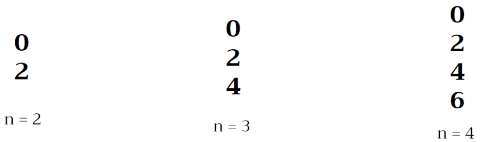

```
    function draw(n) {
    let star = "";
    let count = 0;
    for (let i = 1; i <= n; i++) {
        star += String(count);
        count += 2;
        star += "\n";
    }
    console.log(star);
    }
```

9. 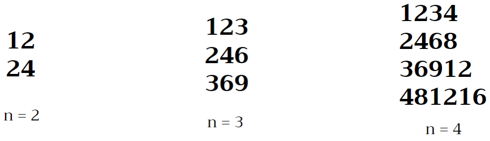

```
    function draw(n) {
    let star = "";
    let count = 2;
    for (let i = 1; i <= n; i++) {
        star += String(count);
        count += 2;
        star += "\n";
    }
    console.log(star);
    }
```

10. 

```
    function draw(n) {
    let star = "";
    for (let i = 1; i <= n; i++) {
        for (let j = 1; j <= n; j++) {
        star += String(j * i);
        }
        star += "\n";
    }
    console.log(star);
    }
```

11. 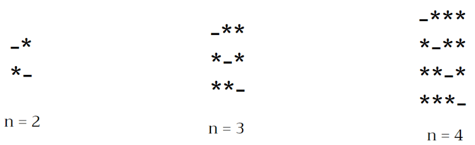

```
    function draw(n) {
    let star = "";
    for (let i = 1; i <= n; i++) {
        for (let j = 1; j <= n; j++) {
        i == j ? (star += "-") : (star += "*");
        }
        star += "\n";
    }
    console.log(star);
    }
```

12. 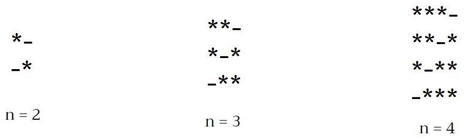

```
    function draw(n) {
    let star = "";
    for (let i = n; i >= 1; i--) {
        for (let j = 1; j <= n; j++) {
        i == j ? (star += "-") : (star += "*");
        }
        star += "\n";
    }
    console.log(star);
    }
```

13. 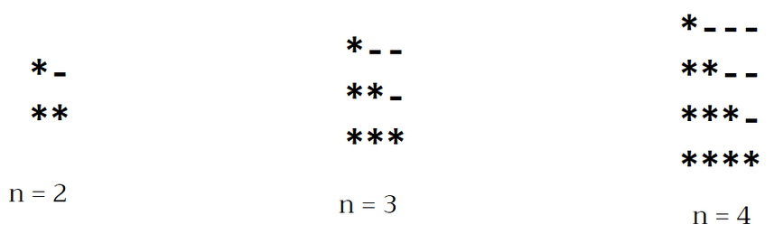

```
function draw(n) {
  let star = "";
  for (let i = 1; i <= n; i++) {
    for (let j = 1; j <= n; j++) {
      j <= i ? (star += "*") : (star += "-");
    }
    star += "\n";
  }
  console.log(star);
}
```

14. 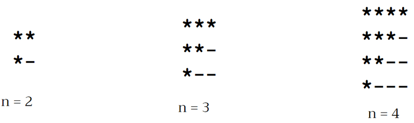

```
    function draw(n) {
    let star = "";
    for (let i = 0; i < n; i++) {
        for (let j = 0; j < n - i; j++) {
        star += "*";
        }
        for (let k = 0; k < i; k++) {
        star += "-";
        }
        star += "\n";
    }
    console.log(star);
    }
```

15. 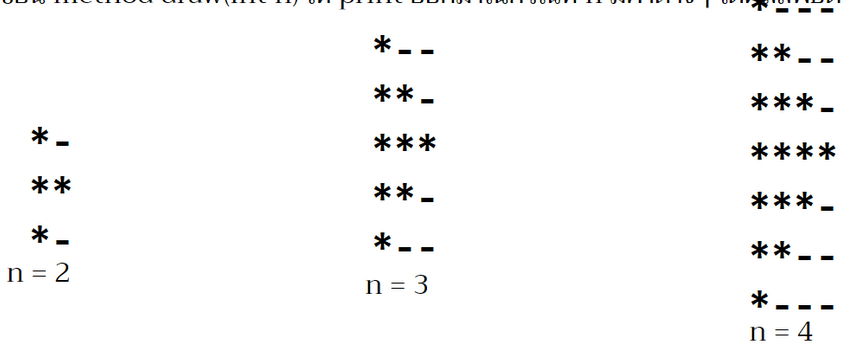

```
    function draw(n) {
    let star = "";
    for (let i = 1; i <= n + (n - 1); i++) {
        if (i <= n) {
        for (let j = 1; j <= i; j++) {
            star += "*";
        }
        for (let k = 1; k <= n - i; k++) {
            star += "-";
        }
        star += "\n";
        } else {
        for (let l = i; l <= n + (n - 1); l++) {
            star += "*";
        }
        for (let m = 1; m <= i - n; m++) {
            star += "-";
        }
        star += "\n";
        }
    }
    console.log(star);
    }
```

16. ไม่มี

17. 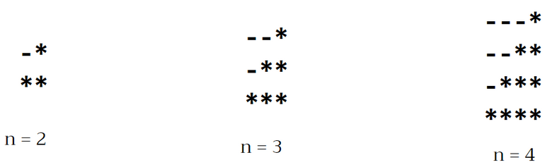

```
    function draw(n) {
    let star = "";
    for (let i = 1; i <= n; i++) {
        for (let j = 1; j <= n - i; j++) {
        star += "-";
        }
        for (let k = 1; k <= i; k++) {
        star += "*";
        }
        star += "\n";
    }
    console.log(star);
    }
```

18. 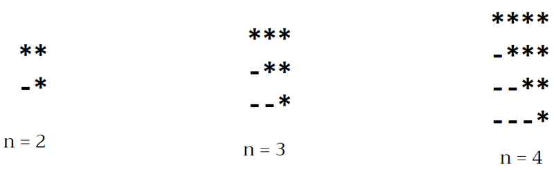

```
    function draw(n) {
    let star = "";
    for (let i = 0; i < n; i++) {
        for (let k = 0; k < i; k++) {
        star += "-";
        }
        for (let j = 0; j < n - i; j++) {
        star += "*";
        }

        star += "\n";
    }
    console.log(star);
    }
```

19. 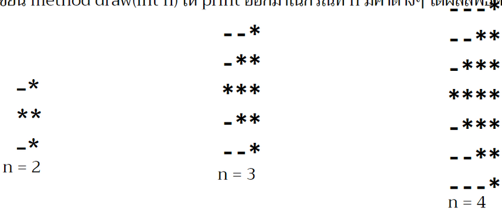

```
    function draw(n) {
    let star = "";
    let line = 2 * n - 1;
    for (let i = 1; i <= line; i++) {
        if (i <= n) {
        for (let j = 1; j <= n - i; j++) {
            star += "-";
        }
        for (let k = 1; k <= i; k++) {
            star += "*";
        }
        star += "\n";
        } else {
        for (let l = 1; l <= i - n; l++) {
            star += "-";
        }
        for (let m = i; m <= line; m++) {
            star += "*";
        }
        star += "\n";
        }
    }
    console.log(star);
    }
```

20. 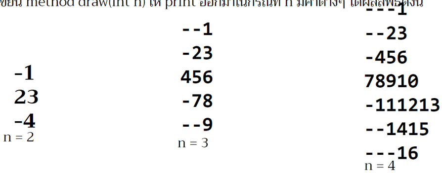

```
    function draw(n) {
    let star = "";
    let line = 2 * n - 1;
    let count = 1;
    for (let i = 1; i <= line; i++) {
        if (i <= n) {
        for (let j = 1; j <= n - i; j++) {
            star += "-";
        }
        for (let k = 1; k <= i; k++) {
            star += String(count);
            count++;
        }
        star += "\n";
        } else {
        for (let l = 1; l <= i - n; l++) {
            star += "-";
        }
        for (let m = i; m <= line; m++) {
            star += String(count);
            count++;
        }
        star += "\n";
        }
    }
    console.log(star);
    }
```

21. 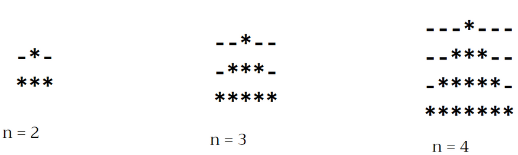

```
    function draw(n) {
    let star = "";
    let line = n;
    let column = 2 * n - 1;
    for (let i = 0; i < line; i++) {
        for (let j = 0; j < column; j++) {
        j >= line - i - 1 && j <= line + i - 1 ? (star += "*") : (star += "-");
        }
        star += "\n";
    }
    console.log(star);
    }
```

22. 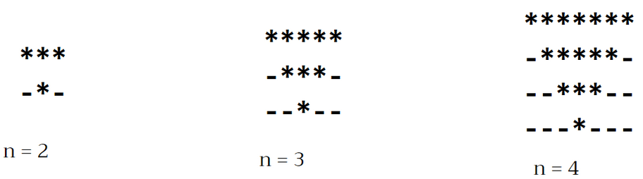

```
function draw(n) {
  let star = "";
  let line = n;
  let column = 2 * n - 1;
  for (let i = line; i > 0; i--) {
    for (let j = column; j > 0; j--) {
      j > line - i && j < line + i ? (star += "*") : (star += "-");
    }
    star += "\n";
  }
  console.log(star);
}
```

23. 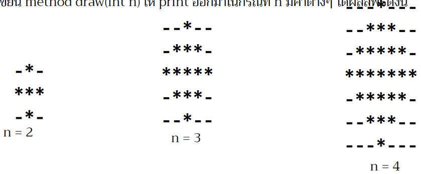

```
    function draw(n) {
    let star = "";
    let line = 2 * n - 1;
    let column = 2 * n - 1;
    for (let i = 1; i <= line; i++) {
        for (let j = 1; j <= column; j++) {
        if (i <= n) {
            j > n - i && j < n + i ? (star += "*") : (star += "-");
        } else {
            j <= i - n || j >= column - (i - n) + 1 ? (star += "-") : (star += "*");
        }
        }
        star += "\n";
    }
    console.log(star);
    }
```

24. 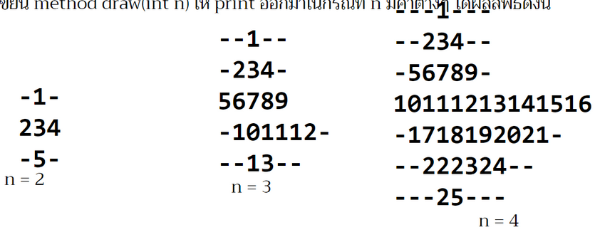

```
    function draw(n) {
    let star = "";
    let count = 1;
    let line = 2 * n - 1;
    let column = 2 * n - 1;
    for (let i = 1; i <= line; i++) {
        for (let j = 1; j <= column; j++) {
        if (i <= n) {
            if (j > n - i && j < n + i) {
            star += String(count);
            count++;
            } else {
            star += "-";
            }
        } else {
            if (j <= i - n || j >= column - (i - n) + 1) {
            star += "-";
            } else {
            star += String(count);
            count++;
            }
        }
        }
        star += "\n";
    }
    console.log(star);
    }
```
