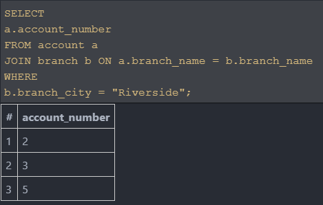
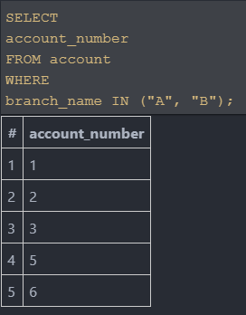
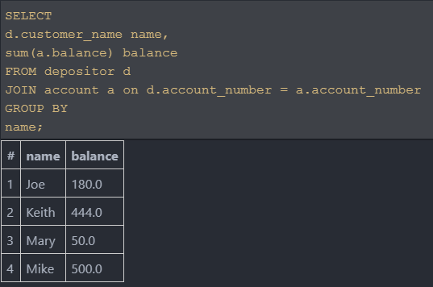
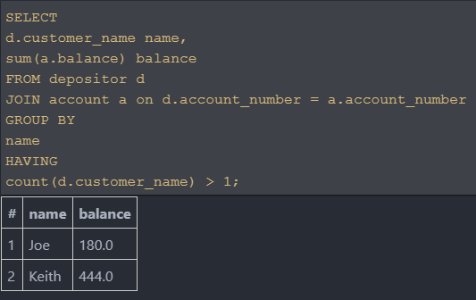
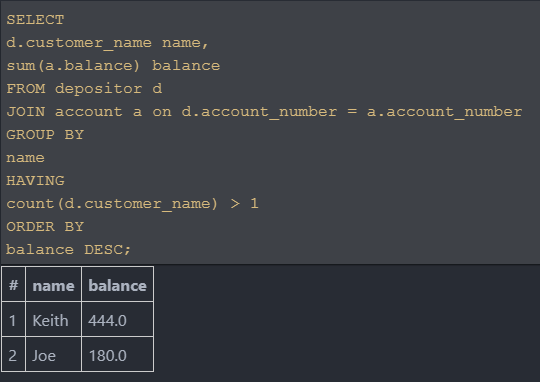

## CodeCamp # 5

## ชญานิน ชลหาญ


| ***Table : account*** | **account_number** | **branch_name** | **balance** |
| --------------------- | :----------------: | :-------------- | ----------: |
|                       |         1          | B               |       100.0 |
|                       |         2          | A               |        50.0 |
|                       |         3          | A               |        30.0 |
|                       |         4          | F               |       120.0 |
|                       |         5          | A               |       500.0 |
|                       |         6          | B               |       324.0 |


| ***Table : borrower*** | **customer_name** | **lone_number** |
| ---------------------- | :---------------- | :-------------: |
|                        | Jason             |        2        |
|                        | Joe               |        1        |
|                        | Joe               |        3        |
|                        | Joe               |        6        |
|                        | Keith             |        4        |
|                        | Mary              |        5        |


| ***Table : branch*** | **branch_name** | **branch_city** | **assets** |
| -------------------- | :-------------: | :-------------- | ---------: |
|                      |        A        | Riverside       |   100000.0 |
|                      |        B        | LA              |    20000.0 |
|                      |        C        | Long Beach      |    15000.0 |
|                      |        D        | Irvine          |    12000.0 |
|                      |        E        | Pomona          |     7000.0 |
|                      |        F        | San Jose        |    18000.0 |


| ***Table : customer*** | **customer_name** | **customer_street** | **customer_only** |
| ---------------------- | :---------------- | :------------------ | :---------------: |
|                        | Alan              | Mary_street         |         Y         |
|                        | Jason             | Jason_street        |         N         |
|                        | Joe               | Joe_street          |         Y         |
|                        | Keith             | Keith_street        |         N         |
|                        | Mary              | Mary_street         |         N         |
|                        | Mike              | Mary_street         |         Y         |


| ***Table : depositor*** | **customer_name** | **account_number** |
| ----------------------- | :---------------- | :----------------: |
|                         | Joe               |         1          |
|                         | Joe               |         2          |
|                         | Joe               |         3          |
|                         | Keith             |         4          |
|                         | Keith             |         6          |
|                         | Mary              |         2          |
|                         | Mike              |         5          |


| ***Table : loan*** | **loan_number** | **branch_name** | **amount** |
| ------------------ | :-------------: | :-------------- | ---------: |
|                    |        1        | B               |      100.0 |
|                    |        2        | E               |       27.0 |
|                    |        3        | F               |      543.0 |
|                    |        4        | A               |      129.0 |
|                    |        5        | A               |       26.0 |
|                    |        6        | B               |       67.0 |

### 1. หาเลขบัญชีที่เปิดในสาขาเมือง Riverside
```sql
SELECT
  a.account_number
FROM account a
JOIN branch b ON a.branch_name = b.branch_name
WHERE
  b.branch_city = "Riverside"
```


### 2. หาเลขบัญชีที่เปิดในสาขาชื่อ A หรือ B
```sql
SELECT
  account_number
FROM account
WHERE
  branch_name IN ("A", "B")
```


### 3. หาจำนวนของเงินทั้งหมดของแต่ละคนฝาก
```sql
SELECT
  d.customer_name name,
  sum(a.balance) balance
FROM depositor d
JOIN account a on d.account_number = a.account_number
GROUP BY
  name
```


### 4. หาจำนวนของเงินทั้งหมดของแต่ละคนฝากที่มีบัญชีธนาคารอย่างน้อย 2 บัญชี
```sql
SELECT
  d.customer_name name,
  sum(a.balance) balance
FROM depositor d
JOIN account a on d.account_number = a.account_number
GROUP BY
  name
HAVING
  count(d.customer_name) > 1
```


### 5. หาจำนวนของเงินทั้งหมดของแต่ละคนฝากที่มีบัญชีธนาคารอย่างน้อย 2 บัญชี โดยเรียงจากมากไปน้อย
```sql
SELECT
  d.customer_name name,
  sum(a.balance) balance
FROM depositor d
JOIN account a on d.account_number = a.account_number
GROUP BY
  name
HAVING
  count(d.customer_name) > 1
ORDER BY
  balance DESC
```
