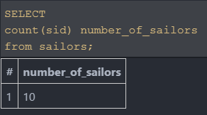
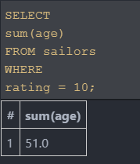
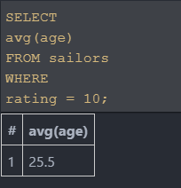
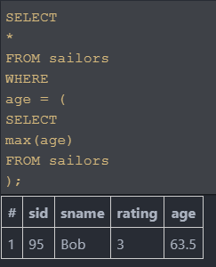
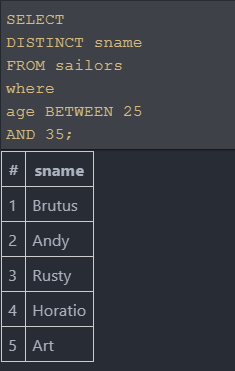

## CodeCamp # 5

## ชญานิน ชลหาญ


| ***Table : sailors*** | **sid** | **sname** | **rating** | **age** |
| --------------------- | :-----: | :-------- | ---------: | ------: |
|                       |   22    | Dustin    |          7 |    45.0 |
|                       |   29    | Brutus    |          1 |    33.0 |
|                       |   31    | Lubber    |          8 |    55.5 |
|                       |   32    | Andy      |          8 |    25.5 |
|                       |   58    | Rusty     |         10 |    35.0 |
|                       |   64    | Horatio   |          7 |    35.0 |
|                       |   71    | Zorba     |         10 |    16.0 |
|                       |   74    | Horatio   |          9 |    35.0 |
|                       |   85    | Art       |          3 |    25.5 |
|                       |   95    | Bob       |          3 |    63.5 |


| ***Table : reserves*** | **sid** | **bid** |  **day**   |
| ---------------------- | :-----: | :-----: | :--------: |
|                        |   22    |   101   | 2010-10-14 |
|                        |   22    |   102   | 2010-10-14 |
|                        |   22    |   103   | 2010-08-14 |
|                        |   22    |   104   | 2010-07-14 |
|                        |   31    |   102   | 2011-10-14 |
|                        |   31    |   103   | 2011-06-14 |
|                        |   31    |   104   | 2011-12-14 |
|                        |   64    |   101   | 2009-05-14 |
|                        |   64    |   102   | 2009-08-14 |
|                        |   74    |   103   | 2009-08-14 |


| ***Table : boats*** | **bid** | **bname** | **color** |
| ------------------- | :-----: | :-------- | :-------- |
|                     |   101   | Interlake | Blue      |
|                     |   102   | Interlake | Red       |
|                     |   103   | Clipper   | Green     |
|                     |   104   | Marine    | Red       |

### 1. หาจำนวนของกะลาสีเรือทั้งหมด

```sql
SELECT
  count(sid) number_of_sailors
from sailors
```



### 2. หาผลรวมของอายุกะลาสีเรือที่มี rating เท่ากับ 10

```sql
SELECT
  sum(age)
FROM sailors
WHERE
  rating = 10;
```



### 3. หาค่าเฉลี่ยอายุของกะลาสีที่มี rating เท่ากับ 10

```sql
SELECT
  avg(age)
FROM sailors
WHERE
  rating = 10;
```



### 4. หาชื่อของคนที่มีอายุมากที่สุด

```sql
SELECT
  sname
FROM sailors
WHERE
  age = (
    SELECT
      max(age)
    FROM sailors
  )
```



### 5. หาชื่อของคนที่มีอายุตั้งแต่ 25 ถึง 35

```sql
SELECT
  DISTINCT sname
FROM sailors
where
  age BETWEEN 25
  AND 35
```


