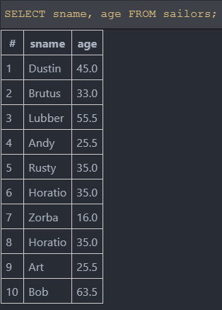
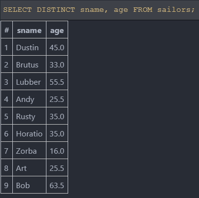
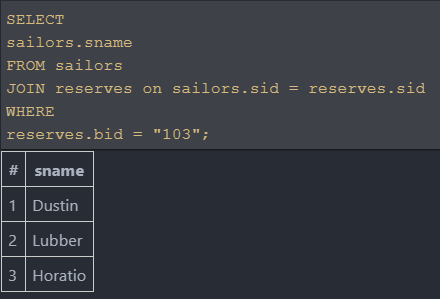
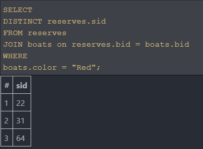
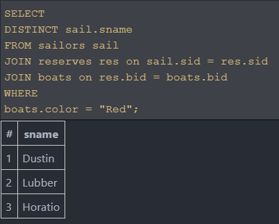
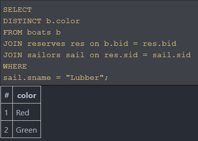
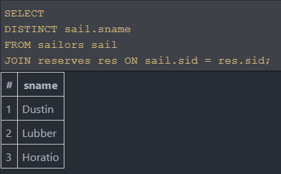
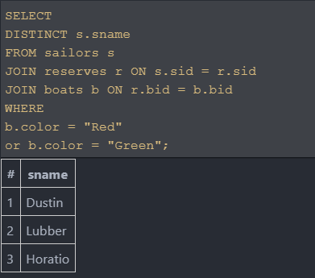
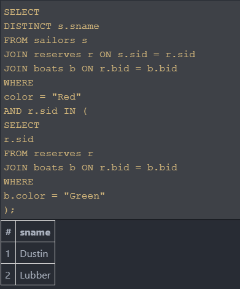
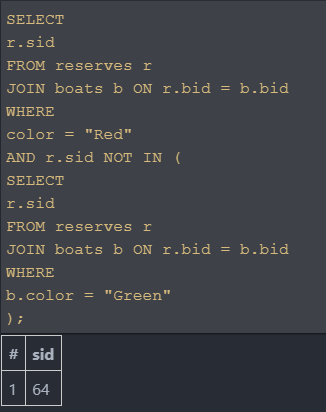

## CodeCamp # 5

## ชญานิน ชลหาญ

| ***Table : sailors*** | **sid** | **sname** | **rating** | **age** |
| --------------------- | :-----: | :-------- | ---------: | ------: |
|                       |   22    | Dustin    |          7 |    45.0 |
|                       |   29    | Brutus    |          1 |    33.0 |
|                       |   31    | Lubber    |          8 |    55.5 |
|                       |   32    | Andy      |          8 |    25.5 |
|                       |   58    | Rusty     |         10 |    35.0 |
|                       |   64    | Horatio   |          7 |    35.0 |
|                       |   71    | Zorba     |         10 |    16.0 |
|                       |   74    | Horatio   |          9 |    35.0 |
|                       |   85    | Art       |          3 |    25.5 |
|                       |   95    | Bob       |          3 |    63.5 |


| ***Table : reserves*** | **sid** | **bid** |  **day**   |
| ---------------------- | :-----: | :-----: | :--------: |
|                        |   22    |   101   | 2010-10-14 |
|                        |   22    |   102   | 2010-10-14 |
|                        |   22    |   103   | 2010-08-14 |
|                        |   22    |   104   | 2010-07-14 |
|                        |   31    |   102   | 2011-10-14 |
|                        |   31    |   103   | 2011-06-14 |
|                        |   31    |   104   | 2011-12-14 |
|                        |   64    |   101   | 2009-05-14 |
|                        |   64    |   102   | 2009-08-14 |
|                        |   74    |   103   | 2009-08-14 |


| ***Table : boats*** | **bid** | **bname** | **color** |
| ------------------- | :-----: | :-------- | :-------- |
|                     |   101   | Interlake | Blue      |
|                     |   102   | Interlake | Red       |
|                     |   103   | Clipper   | Green     |
|                     |   104   | Marine    | Red       |

### 1. ค้นหาชื่อและอายุจากกะลาสีทุกคน
```sql
SELECT
  sname,
  age
FROM sailors;
```


```sql
SELECT DISTINCT
  sname,
  age
FROM sailors;
```


### 2. หาชื่อของกะลาสีเรือทั้งหมดที่จองเรือรหัส 103
```sql
SELECT
  sailors.sname
FROM sailors
JOIN reserves on sailors.sid = reserves.sid
WHERE
  reserves.bid = "103";
```


### 3. หา sids ทั้งหมดของกะลาสีเรือที่จองเรือสีแดง
```sql
SELECT
  DISTINCT reserves.sid
FROM reserves
JOIN boats on reserves.bid = boats.bid
WHERE
  boats.color = "Red"
```


### 4. หาชื่อของกะลาสีเรือทั้งหมดที่จองเรือสีแดง
```sql
SELECT
  DISTINCT sail.sname
FROM sailors sail
JOIN reserves res on sail.sid = res.sid
JOIN boats on res.bid = boats.bid
WHERE
  boats.color = "Red"
```


### 5. หาสีของเรือทั้งหมดที่ถูกจองโดยกะลาสีเรือชื่อ ‘Lubber’
```sql
SELECT
  DISTINCT b.color
FROM boats b
JOIN reserves res on b.bid = res.bid
JOIN sailors sail on res.sid = sail.sid
WHERE
  sail.sname = "Lubber";
```


### 6. หาชื่อของกะลาสีเรือที่จองเรืออย่างน้อย 1 ลำ
```sql
SELECT
  DISTINCT sail.sname
FROM sailors sail
JOIN reserves res ON sail.sid = res.sid;
```


### 7. หาชื่อของกะลาสีเรือทั้งหมดที่จองเรือสีแดงหรือเขียว
```sql
SELECT
  DISTINCT s.sname
FROM sailors s
JOIN reserves r ON s.sid = r.sid
JOIN boats b ON r.bid = b.bid
WHERE
  b.color = "Red"
  or b.color = "Green"
```


### 8. หาชื่อของกะลาสีเรือทั้งหมดที่จองเรือสีแดงและเขียว
```sql
SELECT
  DISTINCT s.sname
FROM sailors s
JOIN reserves r ON s.sid = r.sid
JOIN boats b ON r.bid = b.bid
WHERE
  color = "Red"
  AND r.sid IN (
    SELECT
      r.sid
    FROM reserves r
    JOIN boats b ON r.bid = b.bid
    WHERE
      b.color = "Green"
  )
```


### 9. หา sids ทั้งหมดของกะลาสีเรือที่จองเรือสีแดงแต่ไม่จองเรือสีเขียว
```sql
SELECT
  r.sid
FROM reserves r
JOIN boats b ON r.bid = b.bid
WHERE
  color = "Red"
  AND r.sid NOT IN (
    SELECT
      r.sid
    FROM reserves r
    JOIN boats b ON r.bid = b.bid
    WHERE
      b.color = "Green"
  )
```

