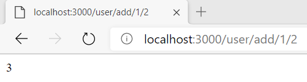

## CodeCamp # 5

## ชญานิน ชลหาญ

**โจทย์ Lab**
- Lab - ทำ path ที่บวกเลข a และ b

*app.js*
```javascript
const express = require("express");
const app = express();

const userRoute = require("./userRoute");

const PORT = 3000;

app.use("/user", userRoute);

app.listen(PORT, () => {
  console.log(`app listening at http://localhost:${PORT}`);
});
```

*userRoute.js*
```javascript
const express = require("express");
const router = express.Router();

router.get("/add/:a/:b", function (req, res) {
  let a = parseInt(req.params.a);
  let b = parseInt(req.params.b);
  res.send(`${a + b}`);
});

module.exports = router;
```

- ลองดู localhost:3000/user/add/1/2  
  