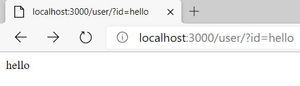
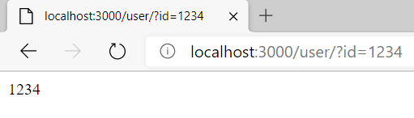
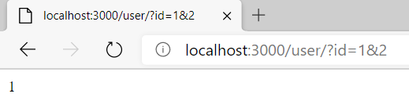

## CodeCamp # 5

## ชญานิน ชลหาญ

**โจทย์ Lab**
- แก้ UserRoute.js ให้เป็นแบบนี้
```javascript
var express = require('express')
var router = express.Router()

router.get('/', function (req, res) {
  res.send(req.query.id)
})

module.exports = router

```

*app.js*
```javascript
const express = require("express");
const app = express();

const userRoute = require("./userRoute");

const PORT = 3000;

app.use("/user", userRoute);

app.listen(PORT, () => {
  console.log(`app listening at http://localhost:${PORT}`);
});
```
*userRoute.js*
```javascript
const express = require("express");
const router = express.Router();

router.get("/", function (req, res) {
  res.send(req.query.id);
});

module.exports = router;
```

- และลอง path ต่อไปนี้
  - localhost:3000/user/?id=hello  
  
  - localhost:3000/user/?id=1234  
  
  - localhost:3000/user/?id=1&2  
  