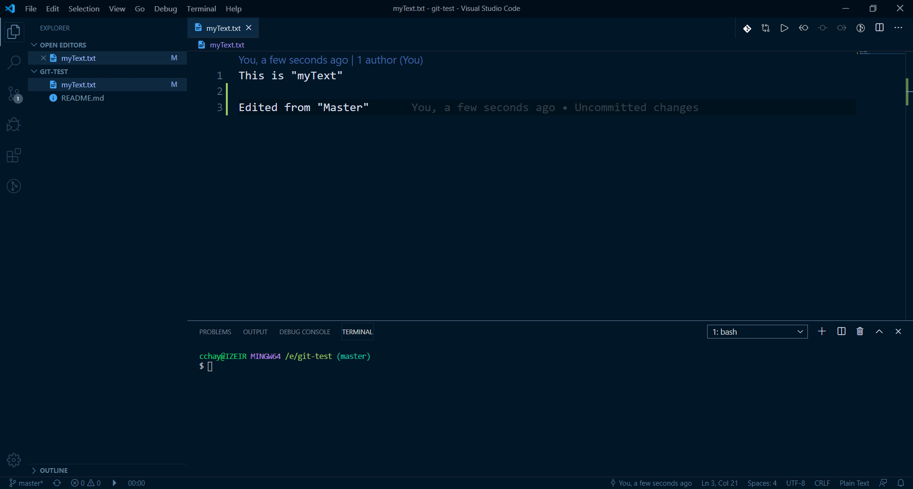
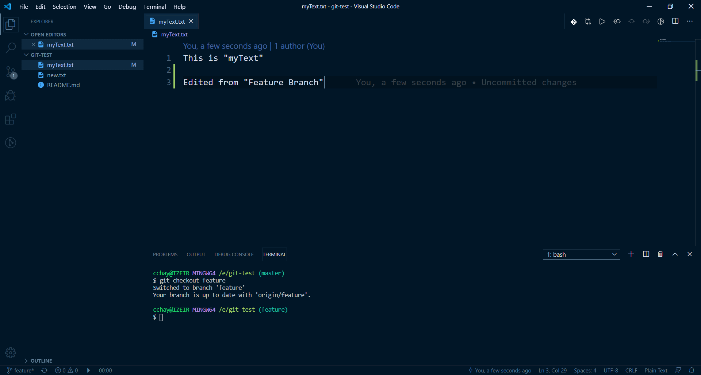
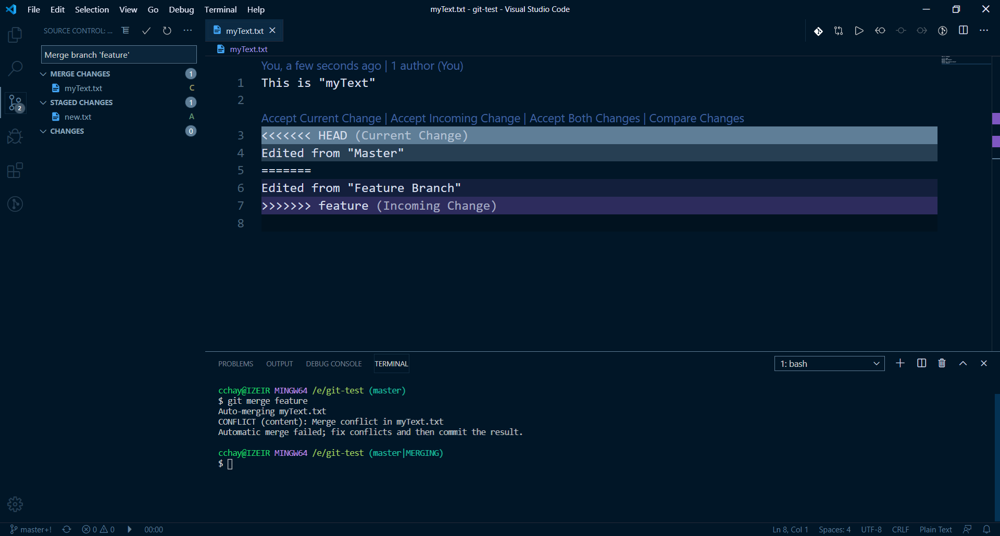
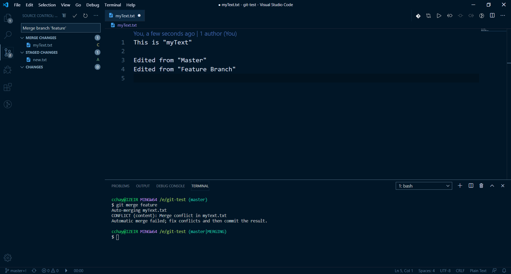
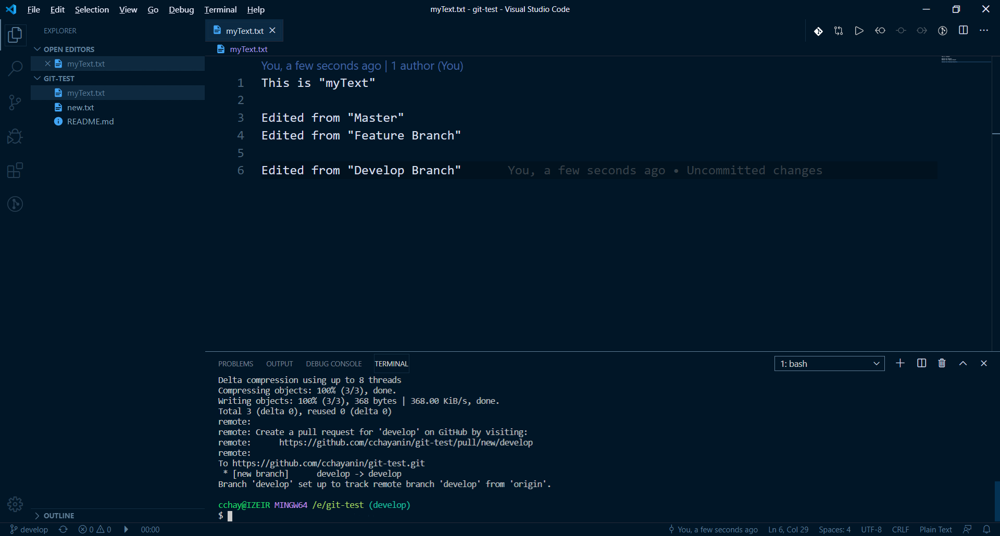
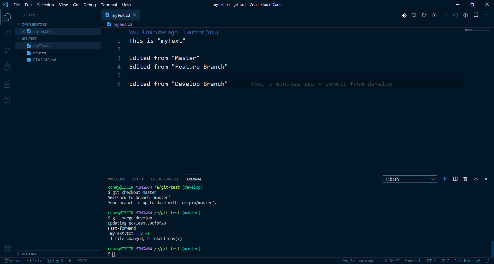
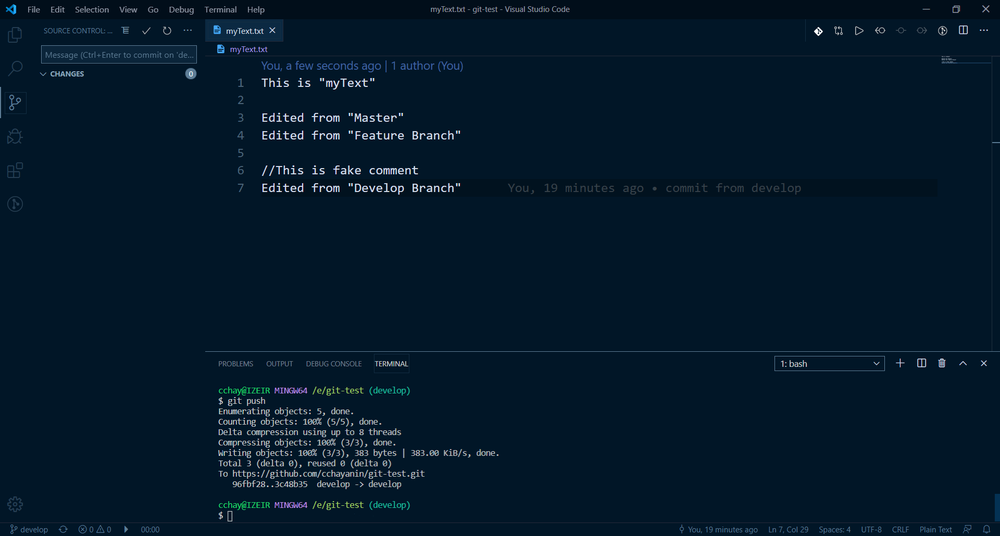
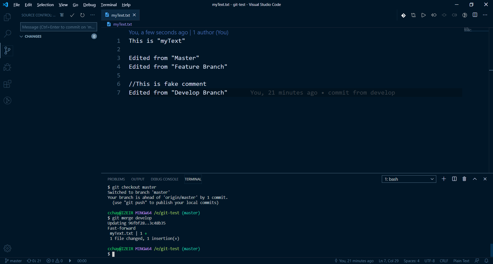

### กรณีมี conflict

- แก้ไข file .txt ใน master  
  

- push ขึ้น repo

- สลับไป branch ที่สร้างเมื่อกี้

- แก้ไข file.txt ให้ไม่เหมือนใน master  
  

- push ขึ้น repo

- ทำการ merge เข้ากับ master  
    
  

### กรณี ไม่มี conflict

- สลับมา branch ใหม่

- แก้ไขไฟล์ .txt  
  
- push ขึ้น repo

- ทำการ merge เข้ากับ master อีกรอบ  
  

### กรณีมี การเพิ่ม comment

- สลับมา branch ใหม่

- แก้ไขไฟล์ .txt แบบ comment  
  

- push ขึ้น repo

- ทำการ merge เข้ากับ master อีกรอบ  
  
