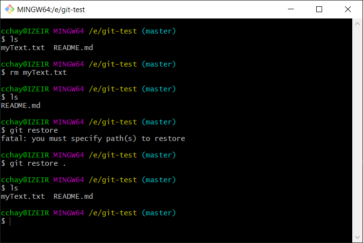

## CodeCamp # 5

## ชญานิน ชลหาญ

- ให้ลองเขียน สร้างไฟล์ .txt

- พิมพ์ข้อความอะไรก็ได้  
  

- save และ ทำการ add file ขึ้น repository ของเรา

- เข้าไปเช็คว่าไฟล์ของเราขึ้นไปหรือไม่ที่เว็บ git  
  

- ลองลบไฟล์ .txt ออก

- ลอง git restore จาก repo มาที่เครื่องเรา  
  
