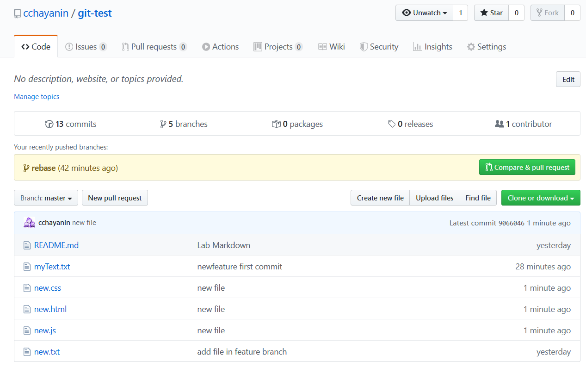
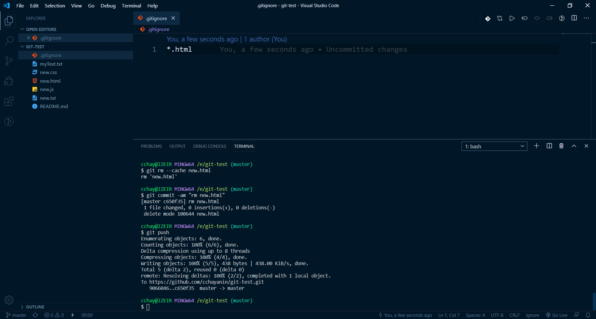
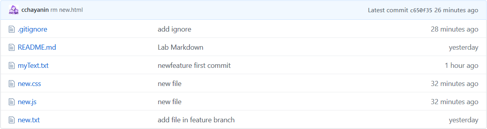
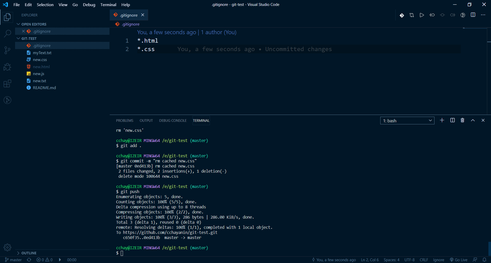
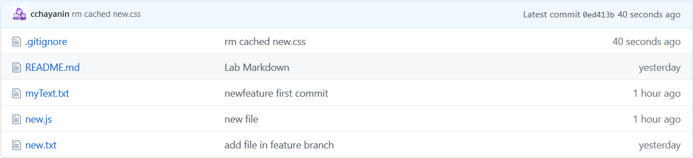
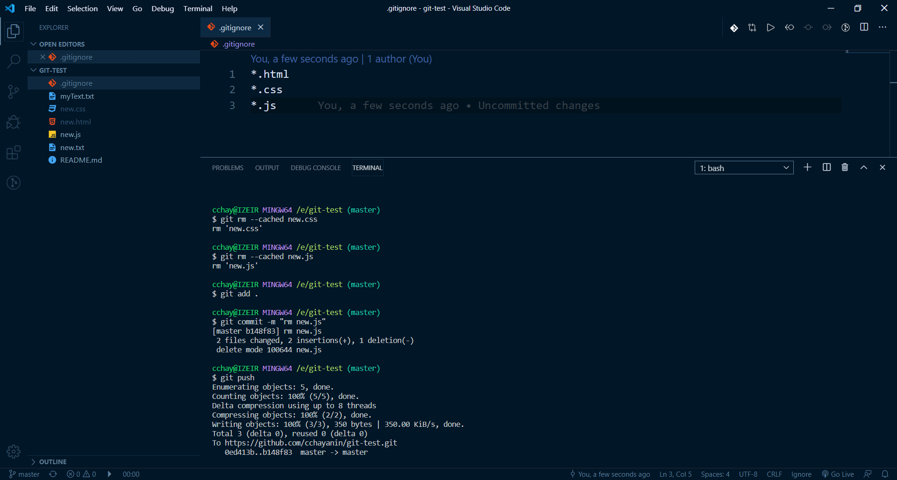
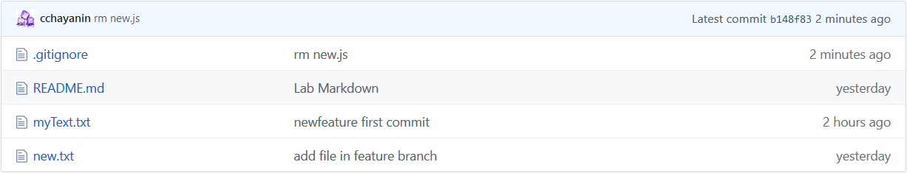

## CodeCamp # 5

## ชญานิน ชลหาญ

- ลอง สร้างไฟล์ .html, .css, .js
- push repo  
  

- ignore ไฟล์ .html  
  
- git rm --cached file_name
- push repo  
  

- edit ignore ไฟล์ .css  
  
- push repo
- git rm --chached file_name
- push repo  
  

edit ignore ไฟล์ .js  
  
push repo  
git rm --cached file_name  
push repo  

