## CodeCamp # 5

## ชญานิน ชลหาญ

### จงเขียน method draw(int n) ให้ print ออกมาในกรณีที่ n มีค่าต่างๆ ได้ผลลัพธ์ดังนี้

### 1.

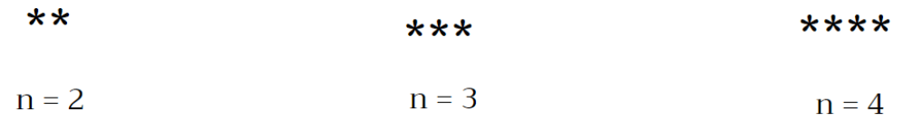

```javascript
function draw(n) {
  let star = "";
  for (let i = 0; i < n; i++) {
    star += "*";
  }
  console.log(star);
}
```

### 2.

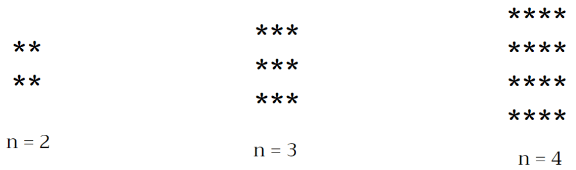

```javascript
function draw(n) {
  let star = "";
  for (let i = 0; i < n; i++) {
    for (let j = 0; j < n; j++) {
      star += "*";
    }
    star += "\n";
  }
  console.log(star);
}
```

### 3.

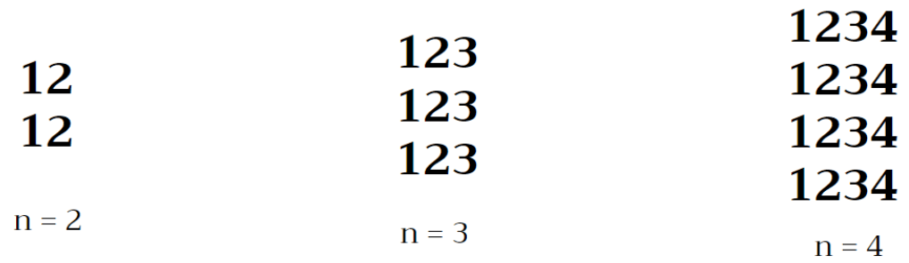

```javascript
function draw(n) {
  let star = "";
  for (let i = 1; i <= n; i++) {
    for (let j = 1; j <= n; j++) {
      star += String(j);
    }
    star += "\n";
  }
  console.log(star);
}
```

### 4.

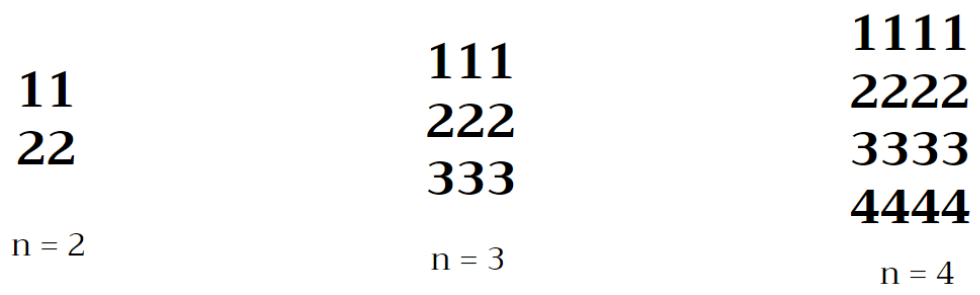

```javascript
function draw(n) {
  let star = "";
  for (let i = 1; i <= n; i++) {
    for (let j = 1; j <= n; j++) {
      star += String(i);
    }
    star += "\n";
  }
  console.log(star);
}
```

### 5.

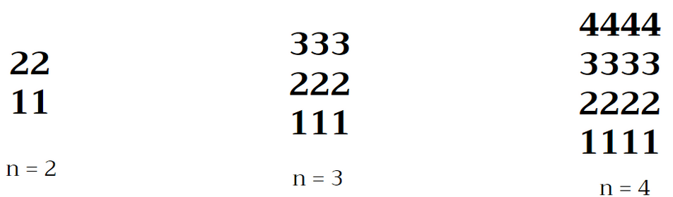

```javascript
function draw(n) {
  let star = "";
  for (let i = n; i > 0; i--) {
    for (let j = n; j > 0; j--) {
      star += String(i);
    }
    star += "\n";
  }
  console.log(star);
}
```

### 6.

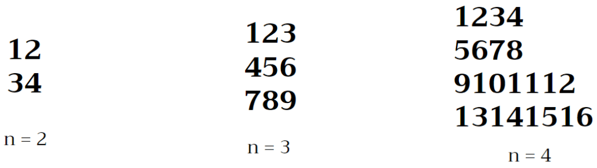

```javascript
function draw(n) {
  let star = "";
  let count = 1;
  for (let i = 1; i <= n; i++) {
    for (let j = 1; j <= n; j++) {
      star += String(count);
      count++;
    }
    star += "\n";
  }
  console.log(star);
}
```

### 7.

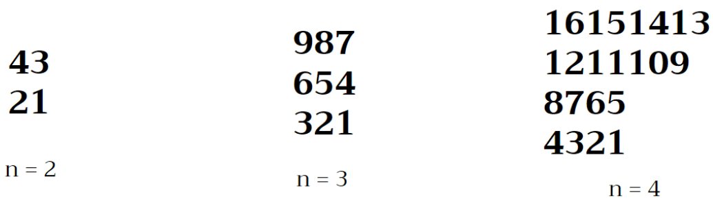

```javascript
function draw(n) {
  let star = "";
  let count = n ** 2;
  for (let i = 1; i <= n; i++) {
    for (let j = 1; j <= n; j++) {
      star += String(count);
      count--;
    }
    star += "\n";
  }
  console.log(star);
}
```

### 8.

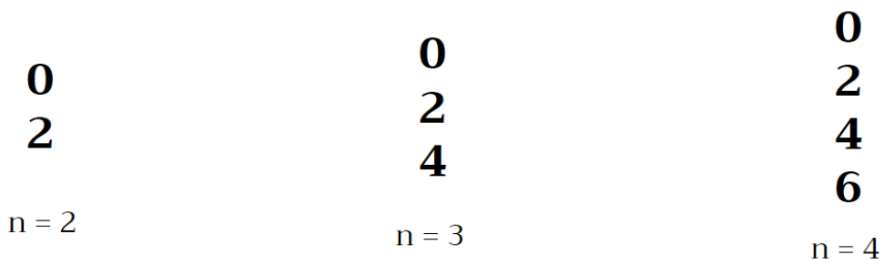

```javascript
function draw(n) {
  let star = "";
  let count = 0;
  for (let i = 1; i <= n; i++) {
    star += String(count);
    count += 2;
    star += "\n";
  }
  console.log(star);
}
```

### 9.

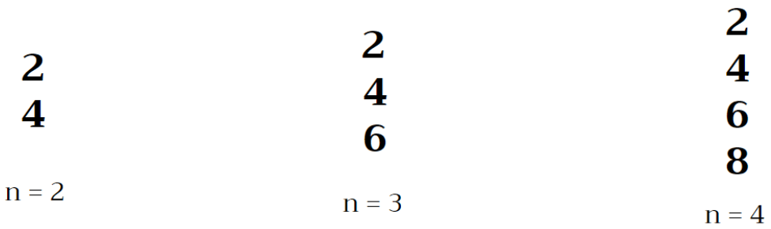

```javascript
function draw(n) {
  let star = "";
  let count = 2;
  for (let i = 1; i <= n; i++) {
    star += String(count);
    count += 2;
    star += "\n";
  }
  console.log(star);
}
```

### 10.

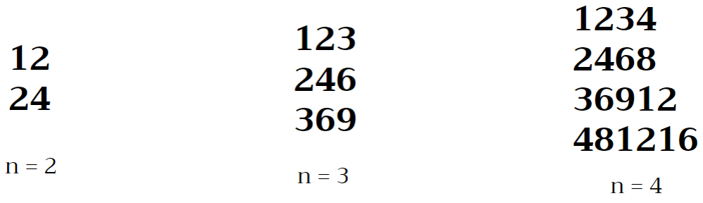

```javascript
function draw(n) {
  let star = "";
  for (let i = 1; i <= n; i++) {
    for (let j = 1; j <= n; j++) {
      star += String(j * i);
    }
    star += "\n";
  }
  console.log(star);
}
```

### 11.

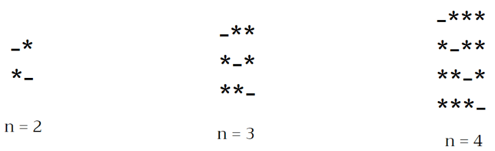

```javascript
function draw(n) {
  let star = "";
  for (let i = 1; i <= n; i++) {
    for (let j = 1; j <= n; j++) {
      i == j ? (star += "-") : (star += "*");
    }
    star += "\n";
  }
  console.log(star);
}
```

### 12.

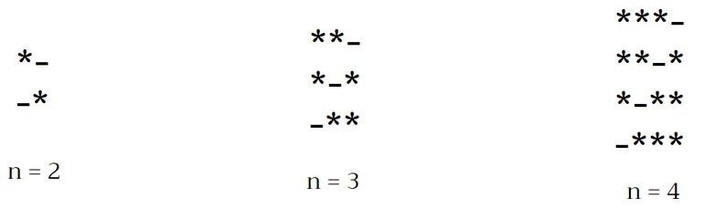

```javascript
function draw(n) {
  let star = "";
  for (let i = n; i >= 1; i--) {
    for (let j = 1; j <= n; j++) {
      i == j ? (star += "-") : (star += "*");
    }
    star += "\n";
  }
  console.log(star);
}
```

### 13.

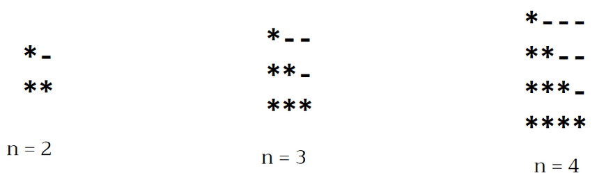

```javascript
function draw(n) {
  let star = "";
  for (let i = 1; i <= n; i++) {
    for (let j = 1; j <= n; j++) {
      j <= i ? (star += "*") : (star += "-");
    }
    star += "\n";
  }
  console.log(star);
}
```

### 14.

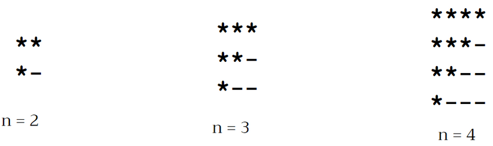

```javascript
function draw(n) {
  let star = "";
  for (let i = 1; i <= n; i++) {
    for (let j = 1; j <= n; j++) {
      j <= n + 1 - i ? (star += "*") : (star += "-");
    }
    star += "\n";
  }
  console.log(star);
}
```

### 15.

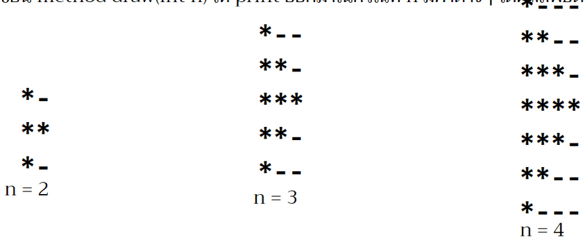

```javascript
function draw(n) {
  let star = "";
  let line = 2 * n - 1;
  let column = n;
  for (let i = 1; i <= line; i++) {
    for (let j = 1; j <= column; j++) {
      if (i <= n) {
        j <= i ? (star += "*") : (star += "-");
      } else {
        j <= line - i + 1 ? (star += "*") : (star += "-");
      }
    }
    star += "\n";
  }
  console.log(star);
}
```

### 16. ไม่มี

### 17.

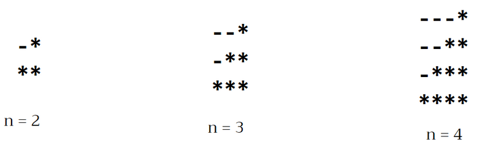

```javascript
function draw(n) {
  let star = "";
  for (let i = 1; i <= n; i++) {
    for (let j = 1; j <= n; j++) {
      j >= n + 1 - i ? (star += "*") : (star += "-");
    }
    star += "\n";
  }
  console.log(star);
}
```

### 18.

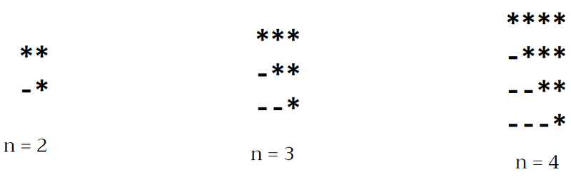

```javascript
function draw(n) {
  let star = "";
  for (let i = n; i >= 1; i--) {
    for (let j = n; j >= 1; j--) {
      j <= i ? (star += "*") : (star += "-");
    }
    star += "\n";
  }
  console.log(star);
}
```

### 19.

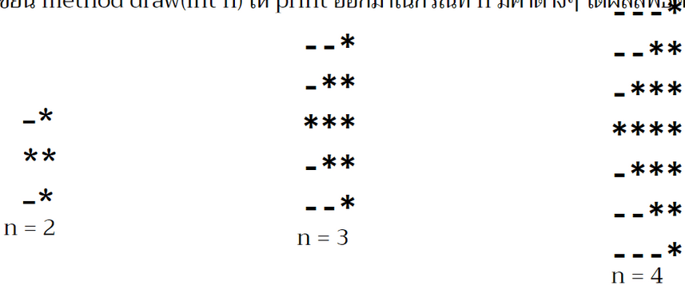

```javascript
function draw(n) {
  let star = "";
  let line = 2 * n - 1;
  let column = n;
  for (let i = 1; i <= line; i++) {
    for (let j = 1; j <= column; j++) {
      if (i <= n) {
        j >= column - i + 1 ? (star += "*") : (star += "-");
      } else {
        j >= i - column + 1 ? (star += "*") : (star += "-");
      }
    }
    star += "\n";
  }
  console.log(star);
}
```

### 20.

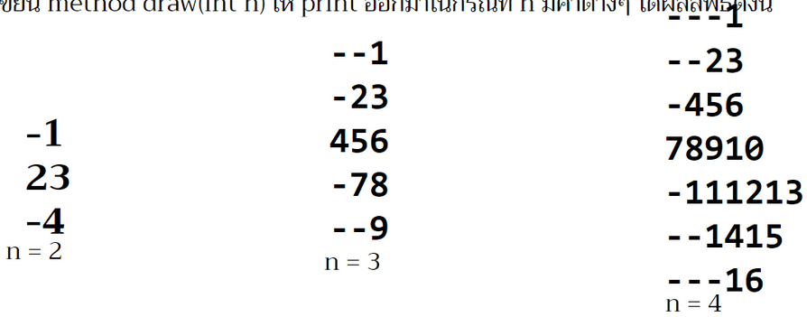

```javascript
function draw(n) {
  let star = "";
  let count = 1;
  let line = 2 * n - 1;
  let column = n;
  for (let i = 1; i <= line; i++) {
    for (let j = 1; j <= column; j++) {
      if (i <= n) {
        j >= column - i + 1 ? (star += String(count++)) : (star += "-");
      } else {
        j >= i - column + 1 ? (star += String(count++)) : (star += "-");
      }
    }
    star += "\n";
  }
  console.log(star);
}
```

### 21.

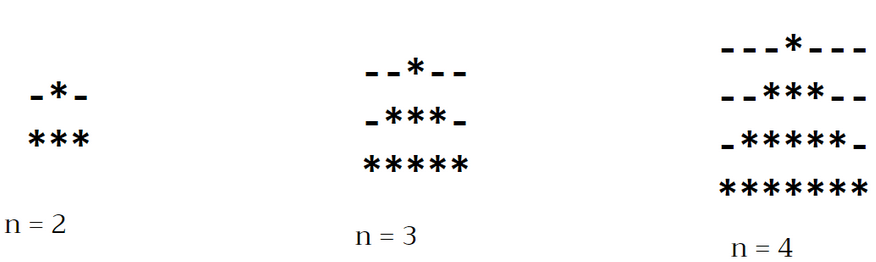

```javascript
function draw(n) {
  let star = "";
  let line = n;
  let column = 2 * n - 1;
  for (let i = 0; i < line; i++) {
    for (let j = 0; j < column; j++) {
      j >= line - i - 1 && j <= line + i - 1 ? (star += "*") : (star += "-");
    }
    star += "\n";
  }
  console.log(star);
}
```

### 22.

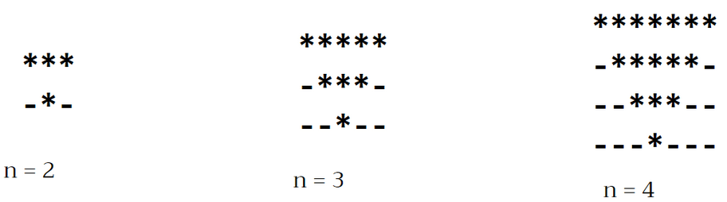

```javascript
function draw(n) {
  let star = "";
  let line = n;
  let column = 2 * n - 1;
  for (let i = line; i > 0; i--) {
    for (let j = column; j > 0; j--) {
      j > line - i && j < line + i ? (star += "*") : (star += "-");
    }
    star += "\n";
  }
  console.log(star);
}
```

### 23.

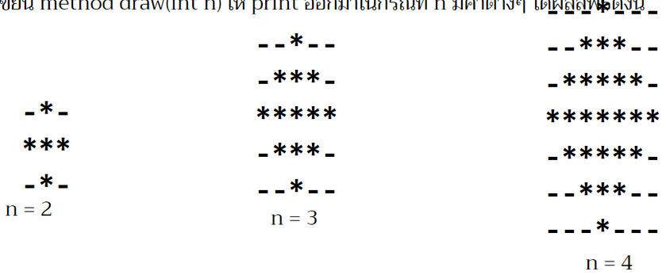

```javascript
function draw(n) {
  let star = "";
  let line = 2 * n - 1;
  let column = 2 * n - 1;
  for (let i = 1; i <= line; i++) {
    for (let j = 1; j <= column; j++) {
      if (i <= n) {
        j > n - i && j < n + i ? (star += "*") : (star += "-");
      } else {
        j <= i - n || j >= column - (i - n) + 1 ? (star += "-") : (star += "*");
      }
    }
    star += "\n";
  }
  console.log(star);
}
```

### 24.

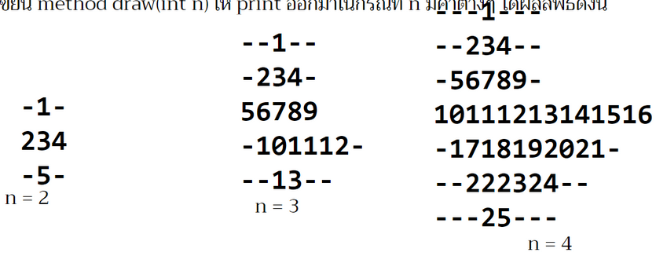

```javascript
function draw(n) {
  let star = "";
  let count = 1;
  let line = 2 * n - 1;
  let column = 2 * n - 1;
  for (let i = 1; i <= line; i++) {
    for (let j = 1; j <= column; j++) {
      if (i <= n) {
        j > n - i && j < n + i ? (star += String(count++)) : (star += "-");
      } else {
        j <= i - n || j >= column - (i - n) + 1
          ? (star += "-")
          : (star += String(count++));
      }
    }
    star += "\n";
  }

  console.log(star);
}
```
