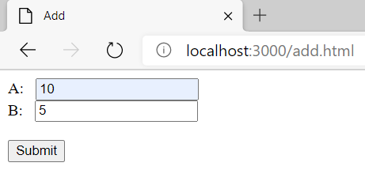
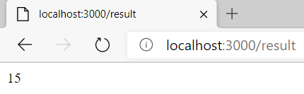

## CodeCamp # 5

## ชญานิน ชลหาญ

**Lab**  
- เขียนฟังก์ชัน add ของ a และ b โดยใช้ body ในการส่ง a และ b มาให้ Express.js

*app.js*
```javascript
const express = require("express");
const bodyParser = require("body-parser");
const app = express();

const PORT = 3000;

app.use(express.static("./public"));
app.use(bodyParser.urlencoded({ extended: true }));

app.post("/result", (req, res) => {
  let a = parseInt(req.body.a);
  let b = parseInt(req.body.b);
  res.send(`${a + b}`);
});

app.listen(PORT, () => {
  console.log(`app listening at http://localhost:${PORT}`);
});
```

*add.html*
```html
<!DOCTYPE html>
<html lang="en">

<head>
    <meta charset="UTF-8" />
    <meta name="viewport" content="width=device-width, initial-scale=1.0" />
    <title>Add</title>
</head>

<body>
    <form action="/result" method="POST">
        <label for="A">A:</label> &nbsp;
        <input type="text" name="a"><br>
        <label for="B">B:</label> &nbsp;
        <input type="text" name="b"><br><br>
        <input type="submit" value="Submit">
    </form>
</body>

</html>
```

  
